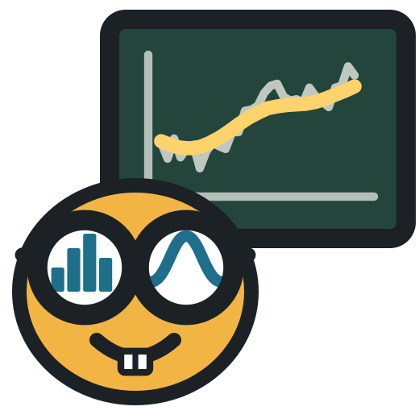
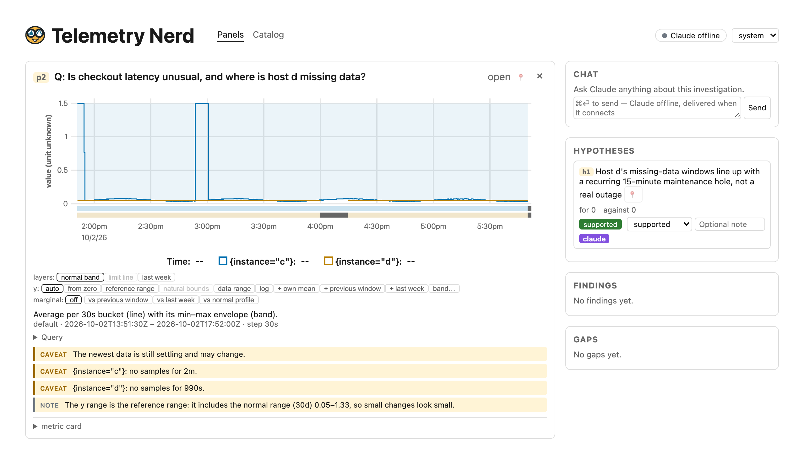

<p align="center">
  
</p>

<h1 align="center">Telemetry Nerd</h1>

<p align="center"><b>Evidence-first telemetry analysis for you and your agent.</b></p>

Telemetry Nerd is a workspace where you and Claude investigate your metrics together. Claude
queries your datasource (e.g. Prometheus, VictoriaMetrics, Thanos), draws graphs into a shared browser workspace,
and writes down what it thinks is going on as hypotheses and findings. Every finding points at
the evidence behind it. You see the same graphs, ask about any part of them, and mark
hypotheses supported or refuted.



## Why

Most dashboards quietly mislead. A 5-minute latency spike disappears once a graph averages
it into 30-minute points. A p99 averaged across hosts is not anyone's p99. Gaps in the data
get drawn as straight lines, so missing data looks like a calm system. An AI that reads those
graphs inherits their mistakes, and then sounds confident about them.

Telemetry Nerd draws telemetry the way a careful scientist would:

- **Peaks survive.** Every rolled-up line carries its min–max envelope, so a short spike still
  reaches its real height when you zoom out.
- **Distributions stay distributions.** Latency histograms are shown as heatmaps, ECDFs and
  exact "fraction over threshold" counts, not as averaged percentiles. A quantile is only drawn
  where there are enough samples to support it.
- **Missing data is visible.** Empty or untrusted buckets are marked under the graph and named
  in a caveat, and lines break at gaps instead of bridging them.
- **Uncertainty comes with the number.** Comparisons carry intervals, periodicity peaks carry
  significance levels, and "is this unusual?" is answered against the spread of previous days
  and weeks, not one noisy reference.
- **Claims are scoped.** Hypotheses and findings are typed objects with the evidence attached,
  so you can check what Claude concluded and why.

The full set of design principles, with the decisions behind them, is in
[`docs/principles.md`](docs/principles.md).

## It knows what your metrics mean

A metric name is not enough to draw or analyse it correctly. A counter, a gauge and a
histogram need different treatment; so do a percentage, a byte count and a ratio. Telemetry
Nerd keeps a catalog of what each metric is: its type, unit, natural bounds, whether it can be
summed across series or over time, and its role (utilization, latency, errors and so on).

Those facts come from the source's own metadata, naming conventions, curated knowledge packs
for common exporters (node_exporter, Kubernetes), measured sample behaviour, and Claude reading
the metrics with you (`/telemetry-nerd:learn`). Each fact records where it came from and how confident it is.
You can confirm or correct any of them from the metric card under a graph, and your word always
wins over every automatic source.

That context decides what you see and which analysis is allowed:

- **Counters are drawn as rates,** never as an ever-growing running total.
- **Bounded metrics get their natural axis.** A ratio is drawn on 0 to 1 and a percentage on
  0 to 100, so a 3% wiggle doesn't fill the screen like a crisis.
- **Every graph knows what normal looks like.** A 30-day operating profile gives each metric a
  reference range and a normal band for the current hour of the week, so an unusual value
  stands out without anyone setting a threshold.
- **Physical limits are drawn.** Available memory is shown against total memory, available
  replicas against all replicas.
- **Units are shown with their origin:** source metadata, inferred from the name, or set by you.
- **Related metrics are linked.** Metrics are connected as parts, limits and derivations of each
  other, and grouped into RED, USE and Little's-law models of a service. When a model is missing
  a signal (say, no concurrency metric), that is recorded as an open gap in the investigation.
- **Wrong analysis is refused, with a hint.** Percentiles are never averaged across hosts or
  over time, raw counters are never fed to a periodogram, and a group of hosts is never
  summarised by the median of their p99s.
- **Contradictions surface.** If a metric's samples behave unlike what is known about it (a
  "counter" that sometimes goes down a little), that becomes a finding you can see, not a silent overwrite.

## What it is, and what it isn't

It **is** an analysis workspace for people who need to understand what their systems are
doing: during an incident, in a capacity review, or when a graph looks wrong.

It **isn't** an "AI SRE" that takes actions on your behalf, a dashboarding tool, or an
alerting system. It reads metrics; it never changes your infrastructure.

## What you can do with it

- Ask questions in plain language and get graphs that each answer one stated question.
- See whether a metric is unusual for this time of day or week (seasonal comparison).
- Find cycles in a series with periodograms and spectrograms.
- Compare distributions across time windows, and count exactly how many requests crossed a
  latency threshold.
- Analyse many series of one metric as a fleet: the spread across hosts, and which members are
  outliers, instead of a hundred overlapping lines.
- Keep track of the investigation: hypotheses, findings, open questions and annotations, all in
  one place that both you and Claude can see.

It works with any Prometheus-compatible source: Prometheus, VictoriaMetrics, Thanos, Mimir and
Grafana datasource proxies. No setup needed to try it: Claude can connect to several public
demo sources (Grafana Play, Wikimedia, the VictoriaMetrics playground and more).

## Getting started

You need [Claude Code](https://claude.com/claude-code) and [uv](https://docs.astral.sh/uv/).

1. Install Telemetry Nerd:

   ```bash
   uv tool install git+https://github.com/Fewbytes/telemetry-nerd
   ```

2. Add the plugin in Claude Code:

   ```
   /plugin marketplace add Fewbytes/telemetry-nerd
   /plugin install telemetry-nerd@telemetry-nerd
   ```

3. Open the workspace at <http://127.0.0.1:7070> and ask Claude something, for example:

   > Connect to grafana-play and show me whether checkout latency got worse in the last 3 hours.

To use your own metrics, set `TN_SOURCE_URL` to your Prometheus or VictoriaMetrics URL before
starting Claude Code, or ask Claude to connect it.

### Or run it as a container

No local Python or Node needed. Images are published for `linux/amd64` and `linux/arm64` on
version tags:

```bash
docker run -d --name telemetry-nerd \
  -p 127.0.0.1:7070:7070 \
  -v tn-data:/data \
  -e TN_SOURCE_URL=http://host.docker.internal:8428 \
  ghcr.io/fewbytes/telemetry-nerd:latest
```

Then open <http://127.0.0.1:7070>, add the plugin as in step 2, and start Claude Code with
`TN_DAEMON_URL=http://127.0.0.1:7070` so the plugin talks to the container instead of starting a
local daemon (and needs no local install of Telemetry Nerd beyond the plugin itself). Images are `ghcr.io/fewbytes/telemetry-nerd`:

| Tag | What |
| --- | --- |
| `X.Y.Z`, `X.Y`, `latest` | slim: the daemon, the UI and the kernel dependencies for Claude's analysis code |
| `X.Y.Z-full`, `X.Y-full`, `latest-full` | slim plus scipy, statsmodels, scikit-learn, ruptures and PyWavelets |

Use the `-full` image if you want Claude's analysis code to use those libraries (nothing can be
installed at runtime). Pin `X.Y.Z` for anything you keep. All state lives in the `/data` volume, so
mount one; the image runs as a non-root user, has a health check, and has **no authentication**:
publish the port on loopback only. Podman works the same. Volumes, upgrades, backups, building the
image yourself and the settings: [docs/install.md](docs/install.md).

> **Status:** early. Metrics only for now (logs and traces are planned), and the API is still
> changing. The workspace has no authentication and listens on `127.0.0.1` only.

---

## For agents: installing and verifying

If you are an agent setting this up for a user, follow these steps exactly and report each
result.

1. Check prerequisites: `uv --version` succeeds. For a source install, `node --version` and
   `npm --version` succeed too (the wheel build compiles the UI).
2. Install: `uv tool install git+https://github.com/Fewbytes/telemetry-nerd`, then
   `telemetry-nerd --help` must succeed. Or, for a container instead:
   `docker run -d --name telemetry-nerd -p 127.0.0.1:7070:7070 -v tn-data:/data
   ghcr.io/fewbytes/telemetry-nerd:latest` (add `-e TN_SOURCE_URL=...`; use the `-full` tag if
   analysis code needs scipy/statsmodels), then step 3, and set `TN_DAEMON_URL=http://127.0.0.1:7070`
   in the environment Claude Code starts with. INSTALL.md has the full runbook.
3. Register the plugin (the user runs these in Claude Code):
   `/plugin marketplace add Fewbytes/telemetry-nerd` and
   `/plugin install telemetry-nerd@telemetry-nerd`. The plugin starts the daemon on demand
   through `scripts/tn-launch`.
4. Point it at metrics: set `TN_SOURCE_URL` (default `http://127.0.0.1:8428`) and
   `TN_SOURCE_FLAVOR` (`victoriametrics` or `prometheus`) in the environment Claude Code starts
   with, or call the `source_connect` tool at runtime. Never pass secrets as tool arguments; use
   `auth_file` or `auth_env`.
5. Verify: `curl -s http://127.0.0.1:7070/api/health` returns `{"ok":true,...}`, the `source_list` tool shows
   the source as `live`, and <http://127.0.0.1:7070> loads in a browser.

Commands: `/telemetry-nerd:start` (connect, learn, open), `/telemetry-nerd:connect`, `/telemetry-nerd:investigate <question>`, `/telemetry-nerd:open`, `/telemetry-nerd:learn`, `/telemetry-nerd:wrap` (propose catalog updates and scoped lessons at the end).

Full details, the container path and network-security notes: [docs/install.md](docs/install.md).
How the graphs are designed and why: [docs/telemetry-graphing-guide.md](docs/telemetry-graphing-guide.md).
Known quirks of real data sources: [docs/data-source-quirks.md](docs/data-source-quirks.md).

## Development

```bash
just test         # Python tests
just lint         # ruff
just ui-install   # once
just ui-test      # UI unit tests
just ui-check     # svelte-check
just e2e          # Playwright UI e2e on the fixture PromQL source (no VictoriaMetrics, no podman)
just test-integration  # -m integration: VictoriaMetrics containers (needs Docker/podman socket)
just test-network      # -m network: public sources over the internet (flaky; non-blocking in CI)
just serve        # run the daemon from the checkout
just dev-up       # local VictoriaMetrics for development (podman compose)
just seed         # push synthetic demo series into it
just brand        # regenerate logo PNGs and favicons from assets/brand/*.svg
```

Work is tracked with [beads](https://github.com/gastownhall/beads) (`bd ready` to see what's
open). Design specs live in `docs/superpowers/specs/`.

Unit tests and the UI e2e suite never read an external VictoriaMetrics: unit tests use fakes and
recorded responses (`tests/fixtures`), and e2e runs the daemon against
`src/telemetry_nerd/devtools/promfixture`, a small Prometheus-API server whose PromQL engine
evaluates synthetic series anchored at its start (specs import their own series into it). Only
`tests/integration` (`-m integration` containers, `-m network` public internet) talks to real backends, for wire and client compatibility.

---

Made by [Avishai Ish-Shalom](https://x.com/nukemberg) at [Fewbytes](https://github.com/Fewbytes).
